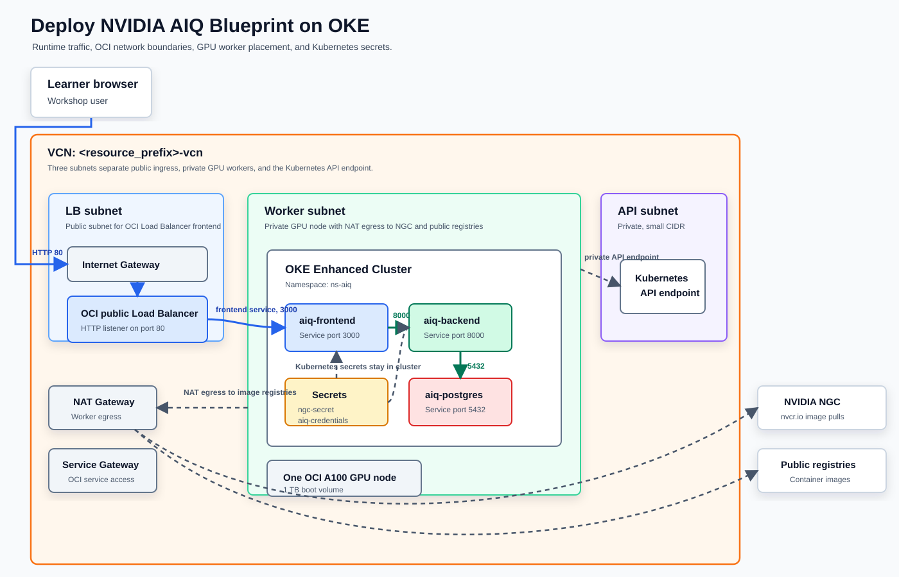

# Deploy NVIDIA AIQ Blueprint on Oracle Kubernetes Engine

## Introduction

NVIDIA AIQ Blueprint gives you a ready-to-run agentic AI application pattern with a frontend, backend, PostgreSQL database, and integrations for NVIDIA and external search services. Oracle Kubernetes Engine gives the blueprint a managed Kubernetes foundation, and OCI GPU shapes provide the accelerator capacity for larger AI workloads.

In this workshop, you deploy AIQ on a fresh OKE environment. You create the network, provision an enhanced cluster, add one A100 GPU node, prepare Kubernetes for a single-node GPU lab, install the AIQ chart from NVIDIA NGC, expose the frontend, and test the application.

The workshop is designed for builders who want the complete flow, including the sharp edges: GPU node images, taints, CoreDNS scheduling, NGC secrets, Tavily credentials, load balancers, and cleanup order.

### Architecture

You will build the environment shown in this architecture diagram:

Runtime traffic flows from the learner browser to the OCI public Load Balancer, then to `aiq-frontend` on port 3000, `aiq-backend` on port 8000, and `aiq-postgres` on port 5432.

The OCI network uses `VCN: <resource_prefix>-vcn` with three subnets:

- API subnet: private, small CIDR, Kubernetes API endpoint.
- Worker subnet: private, GPU node, NAT egress to NGC and public registries.
- LB subnet: public, OCI Load Balancer frontend.

The network also includes a NAT gateway for worker outbound internet, a service gateway for OCI service access, and an internet gateway for public load balancer ingress.

The deployment keeps secrets in Kubernetes. `ngc-secret` supports image pulls from `nvcr.io`, and `aiq-credentials` stores `NVIDIA_API_KEY`, `TAVILY_API_KEY`, `DB_USER_NAME`, and `DB_USER_PASSWORD`.

### Objectives

- Prepare OCI CLI, `kubectl`, Helm, NVIDIA NGC, and Tavily credentials.
- Create a fresh OCI VCN for OKE and AIQ.
- Create an enhanced OKE cluster with a one-node A100 GPU node pool.
- Use a matching OKE Gen2 GPU node image and a 1 TB boot volume.
- Fix common single-node GPU cluster scheduling blockers.
- Deploy NVIDIA AIQ Blueprint from the NGC Helm chart.
- Validate backend health, frontend access, and service DNS.
- Clean up Kubernetes and OCI resources in the correct order.

Estimated Workshop Time: 115 minutes

### Prerequisites

- OCI tenancy access with permissions for Networking, OKE, Compute, Load Balancer, and Block Volume.
- GPU quota and capacity for an A100-capable shape, such as `BM.GPU4.8`.
- OCI CLI installed and configured with the target profile.
- `kubectl`, Helm 3, and `jq`.
- NVIDIA NGC API key.
- Tavily API key.

### Cost and Cleanup

This workshop creates GPU compute, block volume, load balancer, and network resources. GPU nodes can generate significant cost. Complete the cleanup lab when you finish testing.

## Acknowledgements

* **Author** - Alejandro Casas, Sr. Principal Product Marketing Manager, OCI
* **Last Updated By/Date** - Alejandro Casas, June 4, 2026
